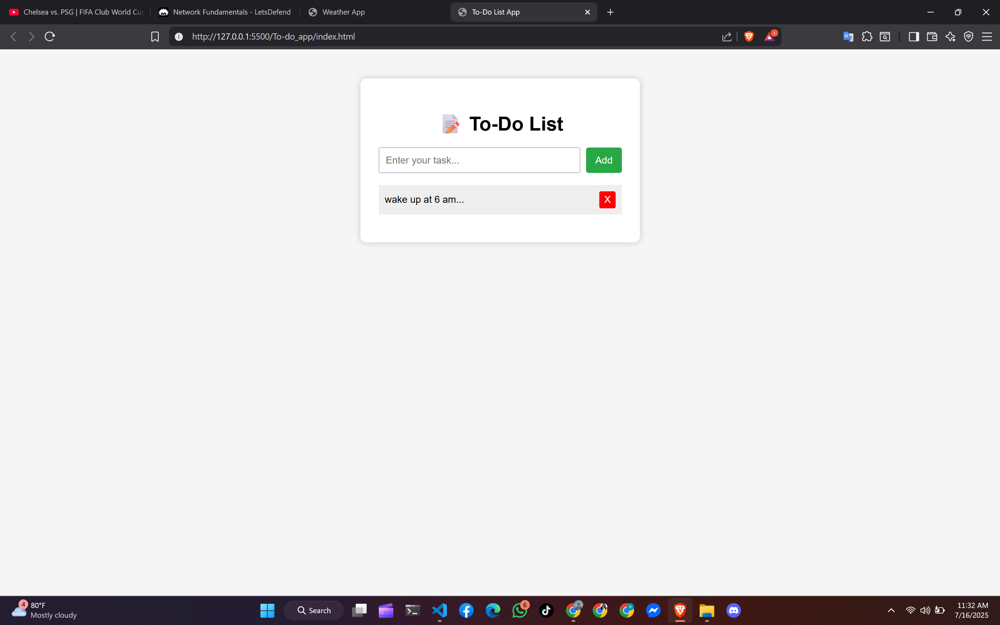

# 📝 To-Do List App

A simple and responsive to-do list application built using HTML, CSS, and JavaScript.

## ✨ Features
- Add tasks
- Mark tasks as complete (click on them)
- Delete tasks (X button)

## 🔧 Tech Stack
- HTML5
- CSS3
- JavaScript

## 🚀 How to Use
1. Clone or download the repo
2. Open `index.html` in your browser
3. Start managing your daily tasks!

## 📸 Screenshot

---

👨‍💻 Developed by Dipesh Pokhrel ([@LETxworld](https://github.com/LETxworld))
